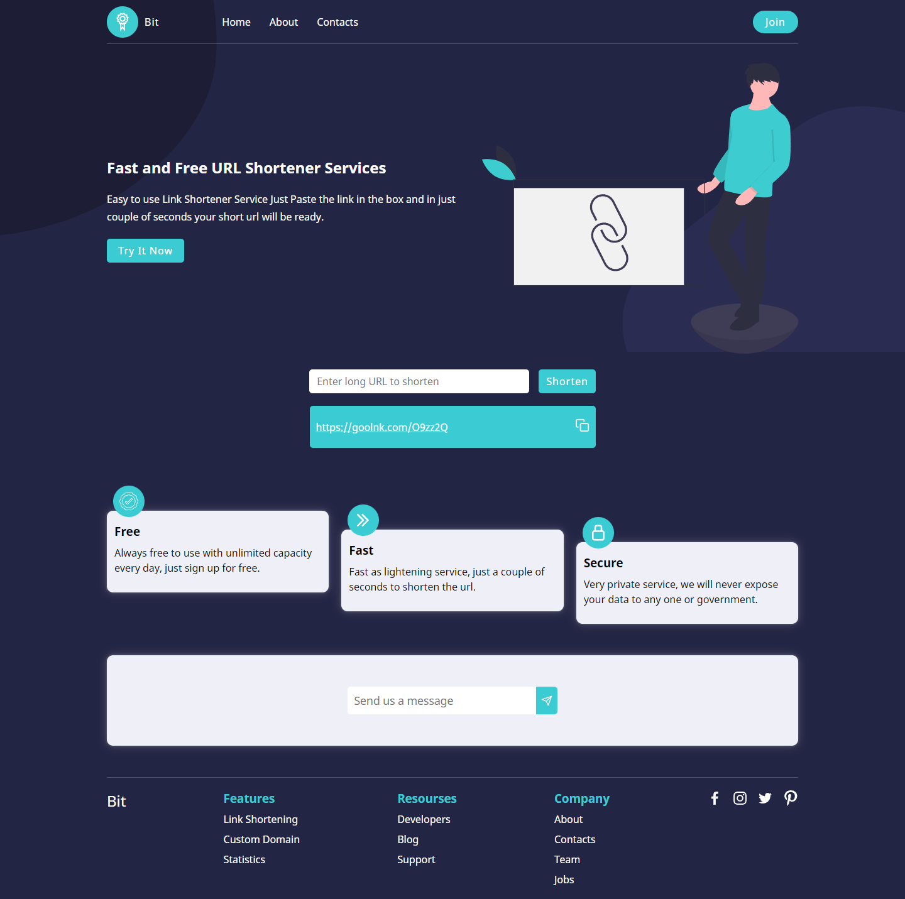
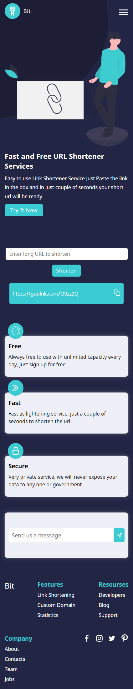

# Link Shortener Service API Landing Page
## Made With React JS and url-shortener-api

### npm packages used in this project
react react-dom react-icons axios

## Available Scripts

In the project directory, you can run:

### `npm start`

Runs the app in the development mode.\
Open [http://localhost:3000](http://localhost:3000) to view it in your browser.

